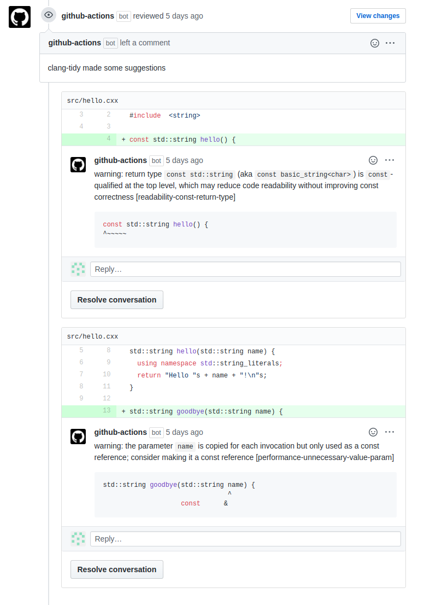

# Clang-Tidy Review

Create a pull-request review based on the warnings from clang-tidy.

Inspired by `clang-tidy-diff`, Clang-Tidy Review only runs on the
changes in the pull request. This makes it nice and speedy, as well as
being useful for projects that aren't completely clang-tidy clean yet.

Where possible, makes the warnings into suggestions so you can apply
them immediately.

Returns the number of comments, so you can decide whether the warnings
act as suggestions, or check failure.

Doesn't spam by repeating identical warnings for the same line.

Can use `compile_commands.json`, so you can optionally configure the
build how you like first.



Example usage:

```yaml
name: clang-tidy-review

# You can be more specific, but it currently only works on pull requests
on: [pull_request]

jobs:
  build:
    runs-on: ubuntu-latest

    steps:
    - uses: actions/checkout@v2

    # Optionally generate compile_commands.json

    - uses: ZedThree/clang-tidy-review@v0.7.0
      id: review
    # If there are any comments, fail the check
    - if: steps.review.outputs.total_comments > 0
      run: exit 1
```

## Limitations

This is a Docker container-based Action because it needs to install
some system packages (the different `clang-tidy` versions) as well as
some Python packages. This that means that there's a two-three minutes
start-up in order to build the Docker container. If you need to
install some additional packages you can pass them via the
`apt_packages` argument.

Except for very simple projects, a `compile_commands.json` file is necessary for
clang-tidy to find headers, set preprocessor macros, and so on. You can generate
one as part of this Action by setting `cmake_command` to something like `cmake
. -B build -DCMAKE_EXPORT_COMPILE_COMMANDS=on`.

GitHub only mounts the `GITHUB_WORKSPACE` directory (that is, the
default place where it clones your repository) on the container. If
you install additional libraries/packages yourself, you'll need to
make sure they are in this directory, otherwise they won't be
accessible from inside this container.

It seems the GitHub API might only accept a limited number of comments
at once, so `clang-tidy-review` will only attempt to post the first
`max_comments` of them (default 25, as this has worked for me).

## Inputs

- `token`: Authentication token
  - default: `${{ github.token }}`
- `build_dir`: Directory containing the `compile_commands.json` file. This
  should be relative to `GITHUB_WORKSPACE` (the default place where your
  repository is cloned)
  - default: `'.'`
- `base_dir`: Absolute path to initial working directory
  `GITHUB_WORKSPACE`.
  - default: `GITHUB_WORKSPACE`
- `clang_tidy_version`: Version of clang-tidy to use; one of 6.0, 7, 8, 9, 10, 11
  - default: '11'
- `clang_tidy_checks`: List of checks
  - default: `'-*,performance-*,readability-*,bugprone-*,clang-analyzer-*,cppcoreguidelines-*,mpi-*,misc-*'`
- `config_file`: Path to clang-tidy config file, replaces `clang_tidy_checks`. Example for a .clang-tidy file at the root of the repo: `config_file: '.clang-tidy'`
  - default: ''
- `include`: Comma-separated list of files or patterns to include
  - default: `"*.[ch],*.[ch]xx,*.[ch]pp,*.[ch]++,*.cc,*.hh"`
- `exclude`: Comma-separated list of files or patterns to exclude
  - default: ''
- `apt_packages`: Comma-separated list of apt packages to install
  - default: ''
- `cmake_command`: A CMake command to configure your project and generate
  `compile_commands.json` in `build_dir`. You _almost certainly_ want
  to include `-DCMAKE_EXPORT_COMPILE_COMMANDS=ON`!
  - default: ''
- `max_comments`: Maximum number of comments to post at once
  - default: '25'
- `lgtm_comment_body`: Message to post on PR if no issues are found. An empty string will post no LGTM comment.
  - default: 'clang-tidy review says "All clean, LGTM! :+1:"'

## Outputs

- `total_comments`: Total number of warnings from clang-tidy

## Generating `compile_commands.json` inside the container

Very simple projects can get away without a `compile_commands.json`
file, but for most projects `clang-tidy` needs this file in order to
find include paths and macro definitions.

If you use the GitHub `ubuntu-latest` image as your normal `runs-on`
container, you only install packages from the system package manager,
and don't need to build or install other tools yourself, then you can
generate `compile_commands.json` as part of the `clang-tidy-review`
action:

```yaml
name: clang-tidy-review
on: [pull_request]

jobs:
  build:
    runs-on: ubuntu-latest

    steps:
    - uses: actions/checkout@v2

    - uses: ZedThree/clang-tidy-review@v0.8.0
      id: review
      with:
        # List of packages to install
        apt_packages: liblapack-dev
        # CMake command to run in order to generate compile_commands.json
        cmake_command: cmake . -DCMAKE_EXPORT_COMPILE_COMMANDS=on
```

If you don't use CMake, this may still work for you if you can use a
tool like [bear](https://github.com/rizsotto/Bear) for example.

## Use in a non-default location

If you're using the `container` argument in your GitHub workflow,
downloading/building other tools manually, or not using CMake, you
will need to generate `compile_commands.json` before the
`clang-tidy-review` action. However, the Action is run inside another
container, and due to the way GitHub Actions work, `clang-tidy-review`
ends up running with a different absolute path.

What this means is that if `compile_commands.json` contains absolute
paths, `clang-tidy-review` needs to adjust them to where it is being
run instead. By default, it replaces absolute paths that start with
the value of [`${GITHUB_WORKSPACE}`][env_vars] with the new working
directory.

If you're running in a container other than a default GitHub
container, then you may need to pass the working directory to
`base_dir`. Unfortunately there's not an easy way for
`clang-tidy-review` to auto-detect this, so in order to pass the
current directory you will need to do something like the following:

```yaml
name: clang-tidy-review
on: [pull_request]

jobs:
  build:
    runs-on: ubuntu-latest
    # Using another container changes the
    # working directory from GITHUB_WORKSPACE
    container:
      image: my-container

    steps:
    - uses: actions/checkout@v2

    # Get the current working directory and set it
    # as an environment variable
    - name: Set base_dir
      run: echo "base_dir=$(pwd)" >> $GITHUB_ENV

    - uses: ZedThree/clang-tidy-review@v0.8.0
      id: review
      with:
        # Tell clang-tidy-review the base directory.
        # This will get replaced by the new working
        # directory inside the action
        base_dir: ${{ env.base_dir }}
```

## Real world project samples
|Project|Workflow|
|----------|-------|
|[BOUT++](https://github.com/boutproject/BOUT-dev) |[CMake](https://github.com/boutproject/BOUT-dev/blob/master/.github/workflows/clang-tidy-review.yml) |
|[Mudlet](https://github.com/Mudlet/Mudlet) |[CMake + Qt](https://github.com/Mudlet/Mudlet/blob/development/.github/workflows/clangtidy-diff-analysis.yml) |


[env_vars]: https://docs.github.com/en/actions/learn-github-actions/environment-variables#default-environment-variables
